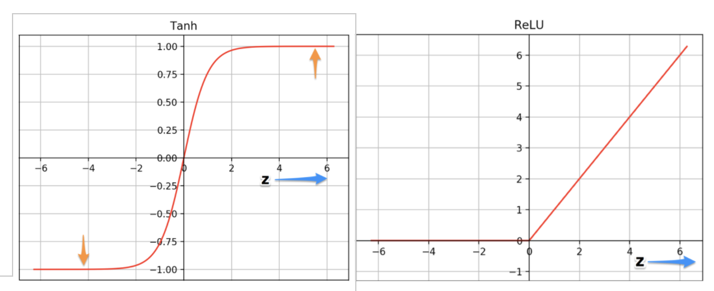
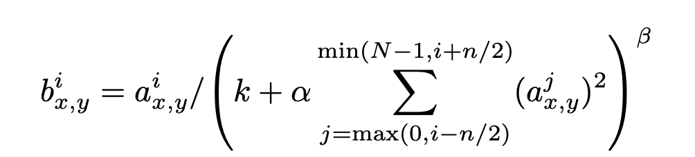
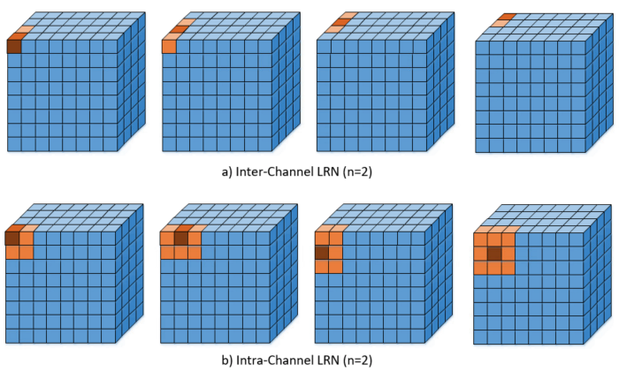
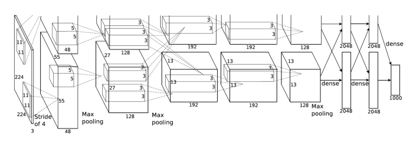
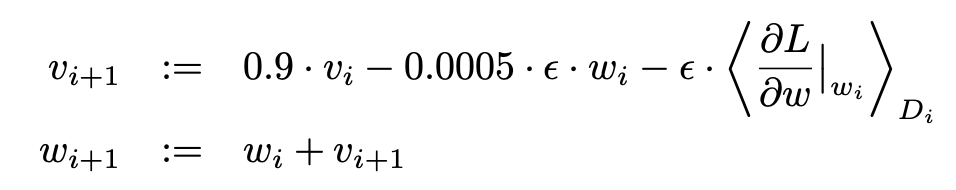

# ImageNet Classification wit Deep Convolutional Neural Networks

Source: https://papers.nips.cc/paper/4824-imagenet-classification-with-deep-convolutional-neural-networks.pdf

by Alex Krizhevsky, Ilya Sutskever & Geoffery Hinton

Year: 2012

## Summary

-   A deep convolutional neural network (AlexNet) was trained to classify images in the ImageNet dataset
-   For the past ILSVRC-2010 ImageNet contest the network achieved top-1 and top-5 error rates of 37.5% and 17.0%
-   For the then current ILSVRC-2012 ImageNet contest the network achieved a winning top-5 error rate of 15.3% (second place was 26.2%)

## How did AlexNet perform so well?

-   Used highly-optimized GPU implementation of 2D convolution and other operations necessary to train convolutional neural networks
-   Used new architecture
-   Used several strategies to reduce overfitting

## Dataset

The ImageNet dataset contains over 15 million labeled images belonging to roughly 22,000 categories. Images were collected from web and labaled by humans using AWS Mechanical Turk. ILSVRC (ImageNet Lare-Scale Visual Recognition Contest) used subset of ImageNet (~1000 images for 1000 categories).

AlexNet required 256x256 images, so images from dataset were rescaled along shorter side and cropped along longer side.

The only preprocessing was centering the RGB pixel values by subtracting the mean of each pixel from each image.

## Architecture

**Highlights:**

-   ReLU
    -   Used ReLU Nonlinearity for activation function instead of the standrd sigmoid or tanh activation function
    -   
    -   Result: much faster training time
-   Multiple GPUs
    -   Trained on two GTx 580 GPUs (3GB memory) - neurons are split over both GPUs, some layers pass their outputs to the other GPU but some layers only pass output to next layer on same GPU
    -   Result: Reduced top-1 & top-5 error rates by 1.7% & 1.5%
-   Local Response Normalization
    -   Normalization is needed because ReLU is unbounded and to encourage lateral inhibition - so locally maximum pixel values are noticed
    -   Inter-Channel LRN is used here direectly after ReLU
        -   Formula: 
            
    -   Result: Reduced top-1 & top-5 error rates by 1.4% & 1.2%
-   Overlapping Pooling
    -   Max Pooling layers summarize the outputs of neighboring groups of neurons by
        -   Sliding a window (size: z x z) across an image with stride (s) and only propogating the maximum neuron value at each window position
    -   AlexNet used z=3 and s=2 so that the windows overlapped
    -   Result: Reduced top-1 & top-5 error rates by 0.4% & 0.3% and made it more difficult to overfit

**Full Architecture:**
Original AlexNet over two GPUs (should start with 227 x 227 x 3)

AlexNet Merged

Convolution and Pooling operations

-   nc: Number of channels/filters
-   Input: (n+2p)2 \* nc-1
-   Filter: f 2 \* nc-1
-   Output: ((n+2p-f)/s + 1) 2 \* nc

## Reducing Overfitting

**Data Augmentation**

1. Image Translation and Horizontal Reflection
    - At training time extract random 224x224 patches (and horizontal reflections) from 256x256 image
    - At test time extract five 224x224 patches (center and corneres) and their reflections and average the 10 softmax layer predictions
    - Result: training set is 2048 times larger, helps prevent overfitting
2. Altering RGB intensities
    - PCA on the set of RGB pixel values throughout the ImageNet training set
    - From 3x3 covariance RGB pixel values matrix we get:
        - Eigenvectors: [p1, p2, p3]
        - Eigenvalues: [λ1, λ2, λ3]
    - A Random variable (α1, α2, α3) is created with Gaussian distribution with mean zero and standard deviation 0.1 for each image
    - Then [p1, p2, p3][α1λ1, α2λ2, α3λ3].T is added to each pixel Ixy = [IxyR, IxyG, IxyB]
    - This approximates chnging the lighting of images
    - Result: Reduced top-1 error rate by over 1%

**Dropout**

-   Each hidden neuron has a 0.5 porbability of being set to 0
-   The neurons that are dropped in this way do not contribute to forward or backward pass
-   Dropout is used in he first two fully-connected layers
-   Result: Doubles number of iterations to converge but substantially limits overfitting

## Learning

-   Stochastic Gradient Descent with batch size of 128 examples
-   The weight update rule is:
    
    -   Momentum = 0.9
    -   Weight decay = 0.0005
    -   Learning rate e was manually tuned throughout training
        -   e = 0.01 initialization
        -   divided by 10 when validation stops improving
