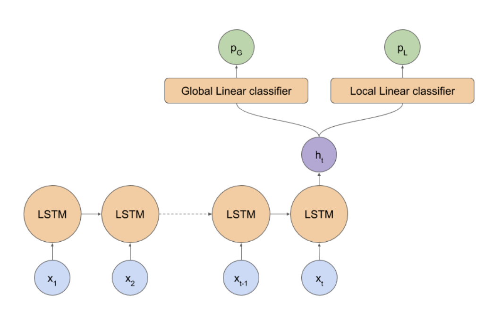

# Rapid Response Crop Maps in Data Sparse Regions

**Source**: https://arxiv.org/pdf/2006.16866.pdf

**Github Repo**: https://github.com/nasaharvest/togo-crop-mask

**Authors**:
- Hannah Kerner, Gabriel Tseng, Inbal Becker-Reshef, Catherine Nakalembe, Brian Barker, Blake Munshell, Madhava Paliyam, Mehdi Hosseini

### Problem
- COVID-19 raises threat of food shortages and rising food prices
- Togo government announced program to boost national food production by distributing aid to farmers and needed a crop map to design this program

### What is a crop map?
- Crop maps identify the pieces of land that have crops
- Crop maps are important for making decisions about:
    - agriculture related policies,
    - early warning for impending crop shortages, 
    - humanitarian assistance,
    - targeted aid, 
    - boosting producitivity of farmers
- High resolution crop maps are not available for many places in Africa
- A challenge of developing crop maps is that many regions do not have readily accessible ground truth data
- Field campaigns are not feasible for collecting labels for rapid response

### Data - Sources
- A global reference database of crowdsourced cropland data 
    - Source: https://doi.pangaea.de/10.1594/PANGAEA.873912
    - Contains ~36k samples, each sample covers an area of 300x300m and a 25*25 grid
    - Defined cropland as a "piece of land of a minimum of 0.25 ha (minimum width of 30 m) that is sowed/planted and harvestable at least once within the 12 months after the sowing/planting date"
    - Perennial crops, agroforestry plantations, palm oil, coffee, tree crops and fallows are not included in the cropland class
    - This dataset helped the paper's model learn general features about identifying cropland globally
- Small dataset with local examples
    - Manually labeled by looking at satellite imagery and drawing polygons over crop and non-crop pixels with Google Earth pro
    - 394 crop and 194 non-crop labels for initial training set
    - Collected additional labels by analyzing initial predicted map to find "confusing/hard examples" (ie. transient vegetation on shorelines)

### Data - Input
- X = {x1, x1, ... x12}, a time series with 12 elements
- Each xi consisted of a least cloudy composite over a 30 day period of 11 optical bands and NDVI (Noralized difference vegetation index), and location info?
- Each xi was created by exporting 160x160m patch for each label and extracting closest pixel in patch to label location 
- During the export all bands (ranging 10-60m resolution) were upsampled to 10m

### Model 

- LSTM with 12 time series input 
- Two headed - two linear classifiers at end one for global data one for local Togo data 
- Loss function: L = ( (W/a)•Lglobal ) + Llocal
    - Where W = # global examples in batch / # of local examples in batch
    - Used a = 10
- Training with early stopping with a patience of 10

### Result
- Delivered high resolution (10 m) cropland map for Togo
- Benchmarked against Copernicus 100m, GFSAD 30m

