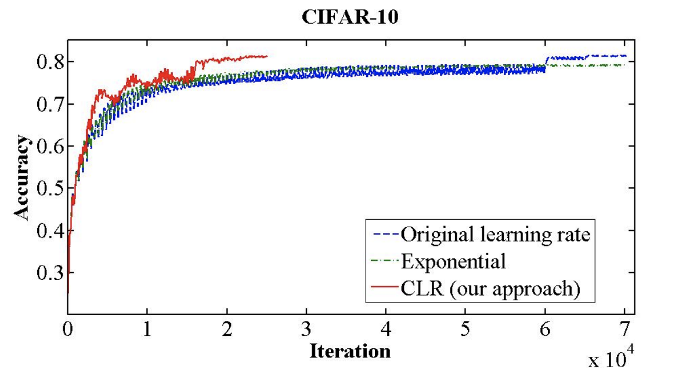
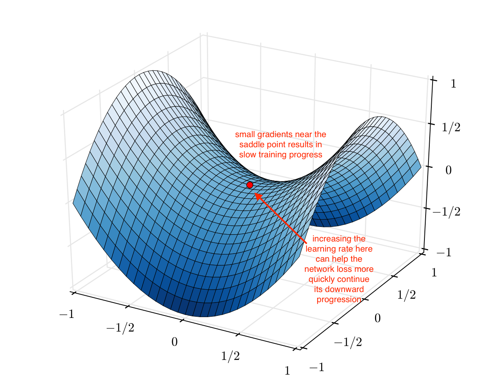
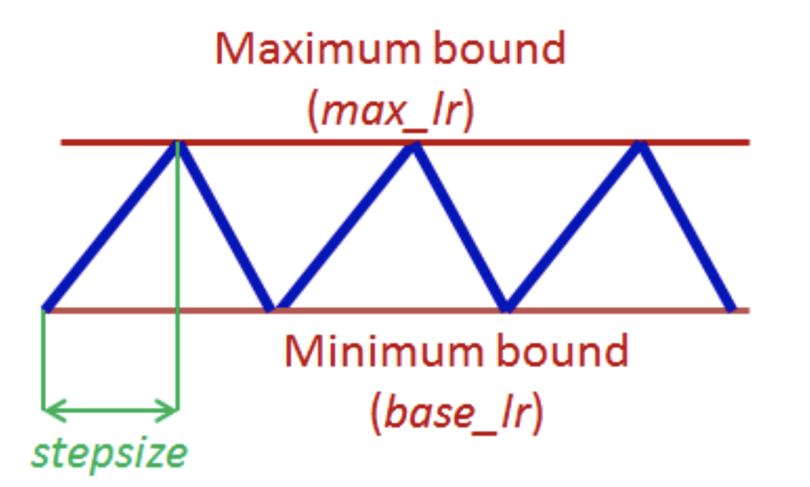
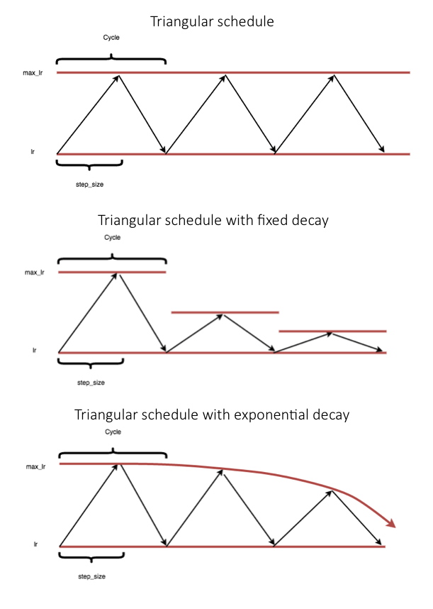
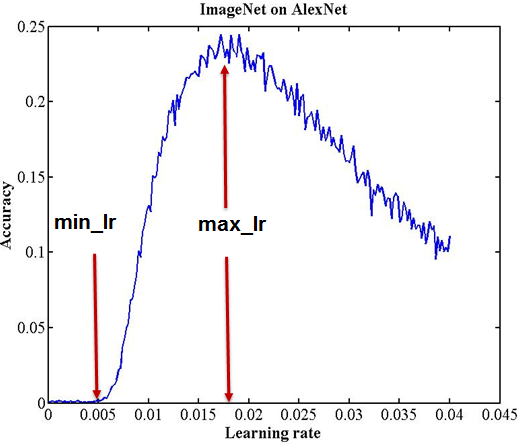
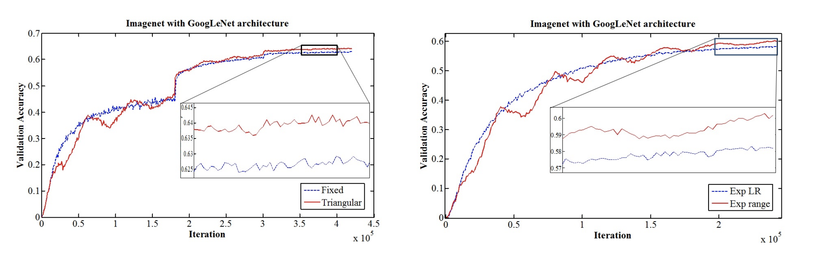

# Cyclical Learning Rates for Training Neural Networks

Source: https://arxiv.org/pdf/1506.01186.pdf

by Leslie N. Smith (U.S. Naval Research Laboratory)

Year: 2015 (original), 2017 (v5)

## Main Idea

Of all hyperparameters that can be tuned during neural network training, tuning the learning rate has the largest impact. This paper:

1. Proposes a cyclical learning rate (CLR) instead of the conventional monotonically decreasing learning rate
2. Proposes a simple method for selecting the bounds of the cyclical learning.
3. Shows that using CLR on standard image classification architectures often produces higher accuracy and faster convergence.



## Intuition

A separate paper argues that optimization in a high dimensional space is difficult because of saddle points rather than poor local minima. With this knowledge, the below image of a saddle point from Jeremy Jordan's [blog post](https://www.jeremyjordan.me/nn-learning-rate/) illustrates the intution behind periodically increasing the learning rate.


## Computing the Cyclical Learning Rate

Different wave types were tested for a cyclical learning rate:

-   Triangle wave
-   Sine wave
-   Parabolic wave

Ultimately all achieved similar results so the triangule wave was chosen for its simplicity.


```Python
def get_lr(base_lr, max_lr, step_size, current_iteration):
    """
    Calculates the current value of the cyclic learning rate
    :param base_lr, float: minimum learning rate boundary
    :param max_lr, float: maximum learning rate boundary
    :param step_size, int: amount of iterations in half a cycle
    :current_iteration, int: current iteration number
    """
    iterations_in_one_cycle = step_size * 2

    # Step function: as current iteration grows, current cycle takes steps
    current_cycle = math.floor(1 + (current_iteration/iterations_in_one_cycle))

    # Linear function
    half_cycle_progress = current_iteration/step_size

    # Saw tooth function, as current iteration grows, position in cycle grows and resets
    position_in_cycle = (half_cycle_progress) - (2*current_cycle)
    # We start with current_cycle at 1 and half_cycle_progress at 0 so the range is (-2,0)

    # Triangle function from 1 to 0 to 1
    x = math.abs(position_in_cycle + 1)

    # Scaled to match learning rate
    lr = base_lr + (max_lr - base_lr)*math.max(0, 1-x)

    return lr

```

Setting the `base_lr` and `max_lr` will be discussed below.
The author achieved good results between
`step_size = 2*(iterations_in_epoch)` and
`step_size = 10*(iterations_in_epoch)`

Above [blog post](https://www.jeremyjordan.me/nn-learning-rate/) is good resource to really understand the above.

## Variants

-   triangular2: Learning rate difference is cut in half at end of each cycle
    -   Denoted as Triagular schedule with fixed decay below
-   exp_range: Each boundary value declines by an exponential factor gamma<sup>current_iteration</sup>
    -   Denoted as Triangular schedule with exponential decay below



Although decay is added to these variants, Leslie Smith goes on to show that decay alone from max_lr to base_lr is not suffficient. The periodic increase of the learning rate is shown to achieve better results on CIFAR10.

## LR Range Test / Getting Good Learning Rate Boundaries

The LR range test consists of running your model for several epochs while linearly increasing the learning rate from a very low to a very high value and tracking the loss or accuracy. Select the `base_lr` as the learning rate when the loss begins to decrease and `max_lr` to the learning rate during the lowest loss before it became too jagged.
In the example below accuracy is used instead of loss.


## Results

| Dataset   | LR policy   | Iterations | Accuracy (%) |
| --------- | ----------- | ---------- | ------------ |
| CIFAR-10  | fixed       | 70,000     | 81.4         |
| CIFAR-10  | triangular2 | 25,000     | 81.4         |
| CIFAR-10  | decay       | 25,000     | 78.5         |
| CIFAR-10  | exp         | 70,000     | 79.1         |
| CIFAR-10  | exp-range   | 42,000     | **82.2**     |
| AlexNet   | fixed       | 400,000    | 58.0         |
| AlexNet   | triangular2 | 400,000    | **58.4**     |
| AlexNet   | exp         | 300,000    | 56.0         |
| AlexNet   | exp         | 460,000    | 56.5         |
| AlexNet   | exp-range   | 300,000    | 56.5         |
| GoogLeNet | fixed       | 420,000    | 63.0         |
| GoogLeNet | triangular2 | 420,000    | **64.4**     |
| GoogLeNet | exp         | 240,000    | 58.2         |
| GoogLeNet | exp-range   | 240,000    | 60.2         |



Better results were achieved with faster convergence on many state-of-the-art architectures at the time using one of the proposed CLR techniques,

Author considered doing a theoretical analysis of this technique and testing it out on Recurrent Neural Nets (RNNs).
