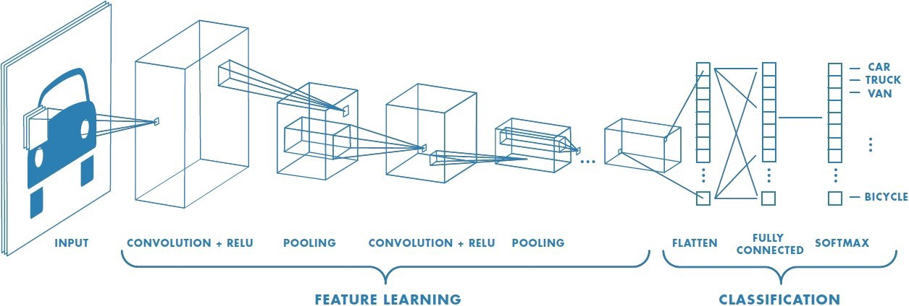

# Deep Learning

Source: https://www.researchgate.net/publication/277411157_Deep_Learning
by Yann LeCun, Yoshua Bengio & Geoffery Hinton

## General

#### What is Deep Learning?

-   Deep Learning is a method that allows computational models to take in raw data (ie. an image) as input and automatically discorver progressively more abstract representations of the data (ie. first representation may represent existence of edges)

#### Why is Deep Learning important?

-   Deep Learning is advantageous over previous Machine Learning methods because it **automatically** learns the features necessary for detection or classification (unlike classical Machine Learning)

-   Additionally performance can increase with more data and computation without much human intervention
-   Deep Learning has allowed for great improvements in speech recognition,visual object recognition, object detection, natural language understanding (ie. language translation)

#### What does a Deep Neural Network consist of?

A neural network contains several layers, every layer contains several units.

**Unit - Calculating z (weighted sum of previous layer)**

-   Each unit takes an input vector `X` (output of previous layer) and uses a weight `W` and bias `b` vector (contained in unit) to calculate `Z`
-   Z = W @ X + b

**Unit - Computing a (activation)**

-   Then `z` is passed through a non-linear activation function to get `a`: the activation/unit output.
-   a = activation(z)
-   Most common activation function is ReLU which is simply: `a = max(z, 0)`

**Layer**

-   The output vector/matrix from each layer is used as the input for the next layer
-   The final layer outputs an output vector (y hat) containing the predicted probabilities for each class

#### How does Deep Learning work?

Supervised Classification:

1. Collect large set of labeled data (x,y)
2. Training
    - Machine is shown the data (x) and the model produces a set of scores (y hat) for each potential category
    - Objective function that takes in the predicted labels (y hat) and the actual labels (y) and outputs the error is defined
    - The machine uses backpropogation to modify its internal weights to reduce the error
        - Backpropogation involves computing the gradient of some weight with respect to the error (using the chain rule)
        - The gradient indicates by what amount the error would increase or decrease if the weight were increased by a tiny amount so the weight vector is adjusted in the opposite direction to the gradient vector
        - Stochastic Gradient Descent (SGD) which involves calculating the average error for a subset of the data and only then calculating the gradient to update the weights (often used in practice to speed up training)
3. Testing
    - The performance of a system is measured on a previsiouly unseen labeled test set by comparing the predicted labels with the actual labels using the error or some other metric

## Convulational Neural Networks

#### What are Convolotunional Neural Networks?

Neural Nets designed for processing data in the form of multiple arrays. Example inputs:

-   1D arrays - signal sequences, including language
-   2D arrays - images or audio spectograms
-   3D arrays - volumetric images

#### What does a ConvNet consist of?

-   Convolutional layers - detect local conjuctions of feature from previous layer
    -   How: convolve the ouput of the previous layer with a series of filters (made up of weights) to get output z and then pass z through an activation layer (such as ReLU), the output is termed a feature map
    -   z = convolve(x, filters)
    -   a = activation(z)
-   Pooling layers - merge similar features from Convulutional layer into one
    -   For example max pooling uses a window of some size and only propagates the largest activation through each window
-   Fully Connected layers lie near the end and resemble a regular network
-   Softmax layer is used to make a classification between several examples

#### Why do ConvNets work?

ConvNets take advantage of properties of natural signals through:

1. local connections - using convolution ensures several pixels/array values are examined as a group
2. shared weights - using same filter across entire image makes it possible to detect the same features regardless of locations
3. pooling - keeps the feture map sizes in check
4. use of many layers - allows for learning of more complex features

## Distributed Representations

Deep Neural Networks discover distributed representations for data. No single unit in the network is responsible for determining the representation but taken together the activations provide a coherent representation.

#### Word Vectors

-   Deep Learning can be applied to learn meaningful word vectors based on the words proximity to other words in the corpus
-   The activations for each word is the word vector

## Recurrent Neural Networks

#### What are Recurrent Neural Networks?

Neural Nets designed for processing sequential data (speech, language)

RNNs have performed well at

-   predicting the next character in text
-   predicting the next word in a sequence
-   predicing the thought expressed in a english sentence
    -   the thought can then be translated to a french sentence using a RNN network as a decoder
-   translating meaning of image
    -   CNN encodes image into vector
    -   RNN decords image vector into sentence

#### How do Recurrent Neural Networks work?

-   RNNs are Neural Nets that process one element at a time
-   Each hidden unit maintains a 'state vector' that contains information about past elements of the sequence
-   h1 = activation( (Wx@x1 + bx) + (Wh@h0 + bh) )
-   y1 = Wy@h1 + by

-   Backpropagation can be applied by considering outputs at different time steps as outputs of a single single neural net

#### Limitations of Recurrent Neural Networks

-   The Recurrent Neural Network is designed to learn long-term dependenies however it has limitations with string information
-   For that reason explicit memory has been introduced with LSTMs

## Future of Deep Learning

-   **Unsupervised learning** will become important as learning in humans is primarily unsupervised
-   Progress can be made in **Computer Vision** by combining Deep Learning (ConvNets, RNNs) with Reinforcement Learning
-   Deep Learning will continue to make an impact in **Natural Language Understanding**, especially when RNNs have strategies for remembering important parts
-   Combining representational learning with **complex reasoning** can lead to major progress
