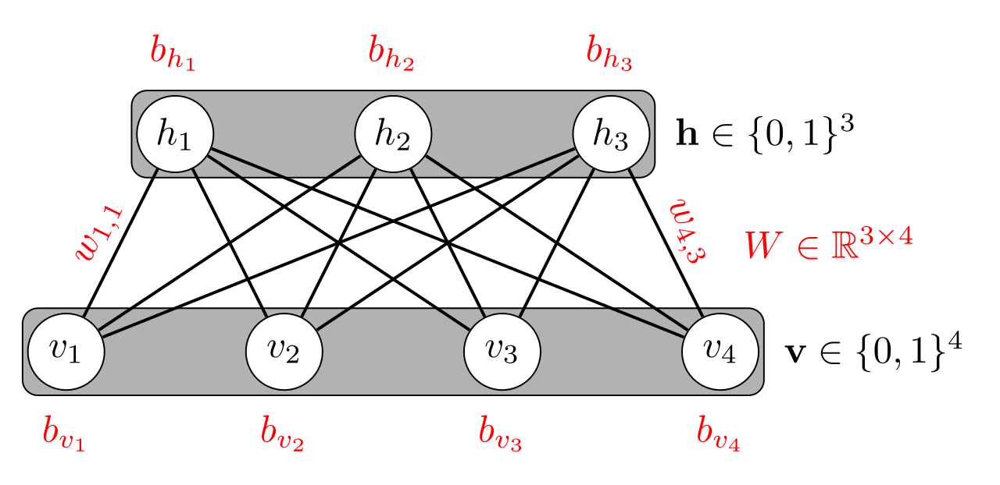
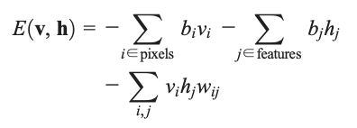
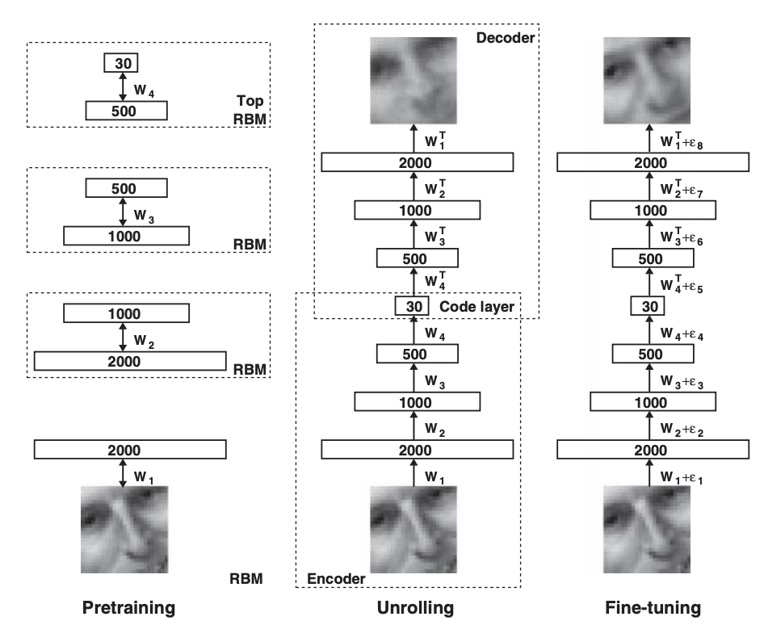
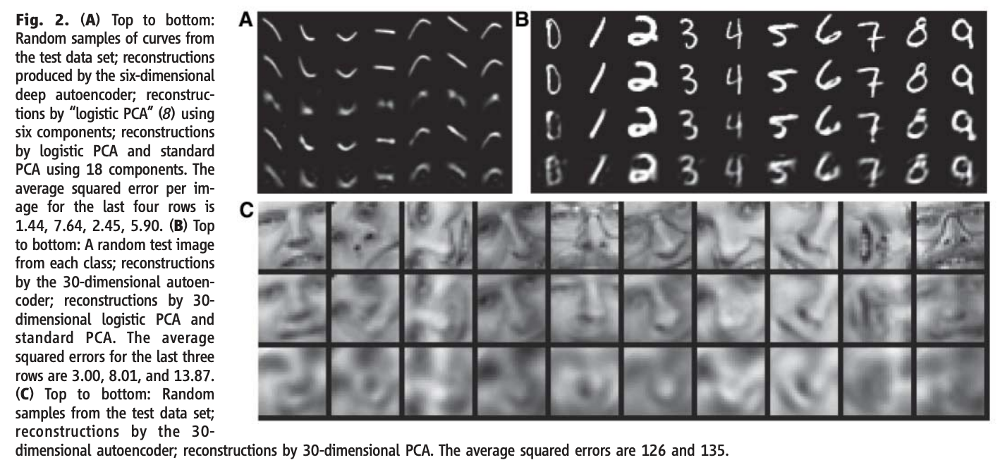

# Dimensionality Reduction with Neural Networks

Source: http://www.cs.toronto.edu/~hinton/science.pdf

by Geoffery Hinton & R. R. Salakhutdinov

Year: 2006

## Summary

-   Reducing the dimensionality of data helps with classification, visualization, communication, and storage of the high dimensional data.
-   PCA (Principal Component Analysis) is often used
-   This paper introduces a novel dimensionality reduction technique using an autoencoder neural network pretrained using Recurrent Boltzmann Machines

## Autoencoders

-   An autoencoder is made up of an encoder (which encodes the input) and a decoder (which reconstructs the input from the code) network
    
-   Once there is more than 2-4 hidden layers it becomes difficult to train the network/optimize the weights because large initial weights find poor local minima and small initial weights have vanishing gradients
-   Back propagation works if the initial weights are close to a good solution

## Restricted Boltzmann Machines (RBMs)

-   Initializing the weights close to a good solution is possible through modeling every layer as a RBM
-   Here v represents a visible layer and h represents a hidden layer
    
-   The paper uses images as input, so we'll consider V to represent the pixels of a black and white image and H the hidden feature detectors
-   The energy ( - score) of every image can be calculated using:
    
-   Passing the score through a sigmoid gives the probability of the combination `p = sigmoid(score)`
-   Training the RBM then consists of adjusting the weights (w) and biases (b) such that the training images and its similar reconstructions (ie confabulations) have a high probability and other combinations of visible units have a lower probability
-   Confabulations are represented through setting the hidden feature detectors to 1 based on probabiliy `sigmoid(bh + sum(vw))` then setting the visible units to 1 based on probabiliy `sigmoid(bw + sum(hw))`
-   The weight update rule is then **delta wij = learning_rate \* (\<vi hj>data - \<vi hj>recon)**
    where \<vi hj> represents amount of times v and h match from data and from confabulation
-   Once the hidden layer accurately represents the visible layer we move to the next two layers in the autoencoder and designate it the next RBM
-   This has the effect of warming up the weights (pretraining)

## Actual Training

-   Once weights are well initialized the autoencoder uses back propagation using a cross-entropy error to fine tune the weights to accurately reconstruct the image
    

## Results

-   Paper shows that Neural Networks can be trained to learn great encodings/feature detectors and that the process can easily be scaled on larger datasets
