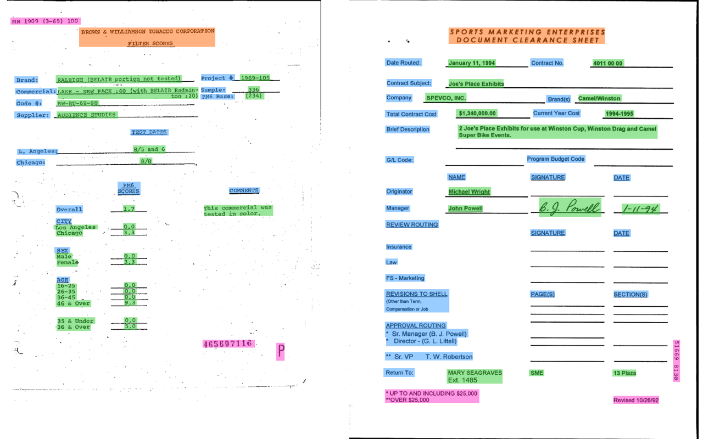
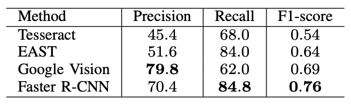
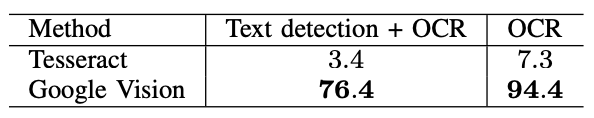

# FUNSD

### A Dataset for Form Understanding in Noisy Scanned Documents

Source: https://arxiv.org/pdf/1905.13538.pdf

Authors:

-   Guillaume Jaume (Swiss Federal Institute of Technology),
-   Hazım Kemal Ekenel (Istanbul Technical University),
-   Jean-Philippe Thiran (Swiss Federal Institute of Technology)

## Form Understnading (FoUn)

-   "the task of automatically extracting and structuring written information in a form"
-   Involves:
    1. Detecting Text
    2. Recognizing Text
    3. Grouping text into entities
    4. Labeling semantic entities: questions, answers, headers, other
    5. Linking entities

## Dataset Creation

-   Dataset is subset of RVL-CDIP dataset (400, 000 grayscale images of various documents from the 1980s–1990s)
-   RVL-CDIP dataset is subset of Truth Tobacco Industry Document (TTID)
-   Authors made their own tool and used Mechanical Turk to annotate

## Labeled Example from Dataset

**A Feature**


**An associated Label / Ground Truth**

```
{
    "form": [
        {
            "id": 0,
            "text": "Registration No.",
            "box": [94,169,191,186],
            "linking": [ [0,1] ],
            "label": "question",
            "words": [
                { "text": "Registration", "box": [94,169,168,186] },
                { "text": "No.", "box": [170,169,191,183]}
            ]
        },
        {
            "id": 1,
            "text": "533",
            "box": [209,169,236,182],
            "label": "answer",
            "words": [
                { "text": "533", "box": [209,169,236,182], }
            ],
            "linking": [ [0,1] ]
        }
    ]
}
```

Notes:

-   "linking" uses format [id<sub>from</sub>, id<sub>to</sub>]
-   "box" uses format [x<sub>left</sub>, y<sub>top</sub>, x<sub>right</sub>, y<sub>bottom</sub>]

**How it looks (the labels)**


## Dataset Stats

-   199 forms
-   ~30k words
-   ~10k entities
    -   ~600 headers
    -   ~4k questions
    -   ~4k answers
    -   ~1k other
-   ~5k relations

## Text Detection Baseline

-   Measuring the detection of bounding boxes for text using IoU>0.5
    

## Text Recognition / OCR Baseline

-   Measured using Levenshtein distance between predicted word and actual word
    -   Predicted word is determined by IoU>0.5
-   If predicted word gets a score of 0.95 it is deemed correct
-   In below table Text detection + OCR essentially indicates recall and OCR essentially indicated precision
    

## Form Understanding Baseline

Authors break down into three tasks:

1. Word Grouping
2. Semantic Entity Labeling (question, answer, header, other)
3. Entity Linking
