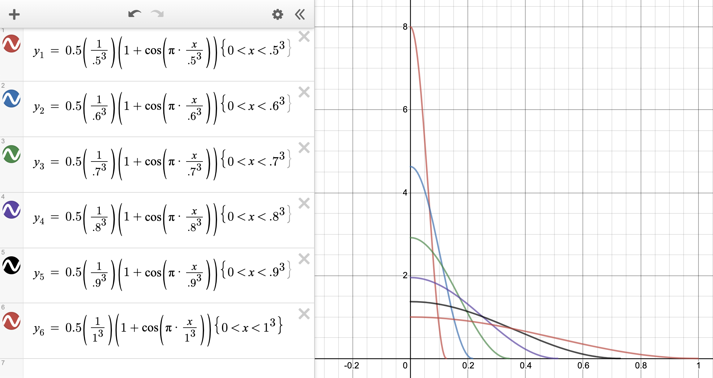

# FreezeOut: Accelerate Training by Progressively Freezing Layers

Source: https://arxiv.org/abs/1706.04983

by Andrew Brock, Theodore Lim, J.M. Ritchie & Nick Weston (Edinburgh, UK - Heriot-Watt University)

Year: 2017

## Main Idea

Improve deep learning model training time by progressively decreasing the learning rates of each layer to 0 starting with the first layer and ending with the last layer.

## Intuition

In deep architectures, the early layers learn simple configurations (ie. edge detectors) yet take a large portion of the training budget. The FreezeOut technique stems from the idea that the early layers do not require as much fine tuning as the later layers.

## Math

Each layer's learning rate ai depends on

-   the current iteration t and
-   the specific layer's last iteration ti

> In all example graphs:
>
> -   y-axis represents percentage of learning rate ( ai( t ) )
> -   x-axis represents percentage of iterations ( t )

#### 1. Standard Decrease

ai(t) = 0.5 \* ai(0)(1 + cos( π t / ti ))

#### 2. Scaling decrease by layer's last iteration ( ti )

-   Each learning rate travels the same distance

ai(t) = 0.5 \* ( a / ti )(1 + cos( π t / ti ) )

#### 3. Cubing layer end iteration ( ti3 )

-   Gives more time for training later layers

ai(t) = 0.5 • ai(0)(1 + cos( π t / ti3 ))

#### 4. Scaling decrease and cubing layer end iteration (ti):

ai(t) = 0.5 • ( a / ti3 )(1 + cos( π t / ti3 ))

## Experiments

Tested each of the four learning rate scheduling strategies on CUFAR-10 and CIFAR-100 with:

-   DenseNets (faster and same accuracy),
-   wide ResNets (faster and better accuracy),
-   VGG (no improvement)

## Conclusion:

Calculation for figuring out how much faster you can train with FreezeOut:

ci := cost of one forward or backward pass for a conv layer

C := total cost of training for n iterations

Cwithout FreezeOut = ∑ ( 2ci • niteration)

Cwith FreezeOut = ∑ ( ( 1 + ti ) • ci • niteration)

Then the speedup when using FreezeOut is 1 - Cwith FreezeOut/Cwithout FreezeOut

Authors recommend a default stratey of cubic scheduling with learning rate scaling with t0 = 0.8 to minimize training time within a 3% relative error.

## Code

https://github.com/ajbrock/FreezeOut
