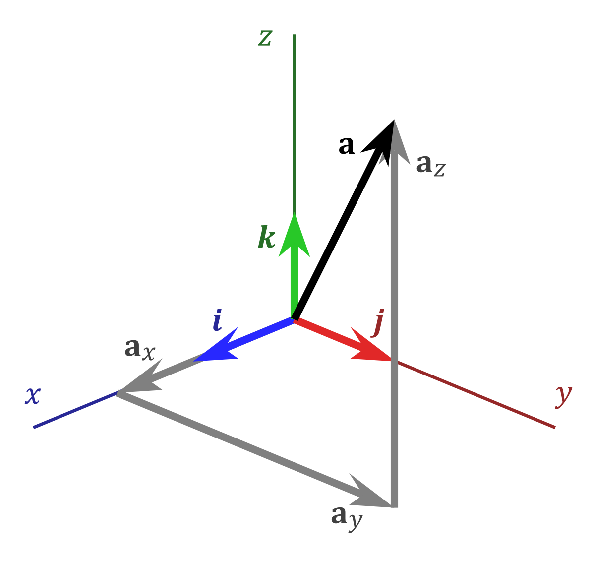
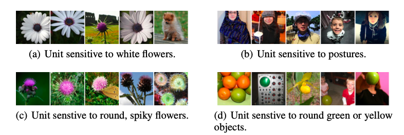
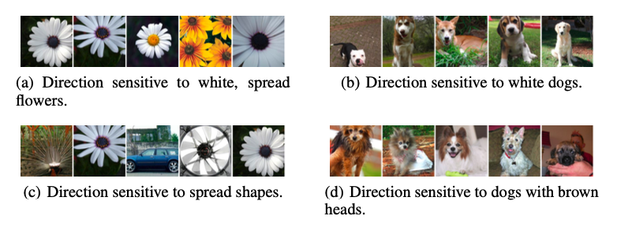

# Intriguing properties of neural networks

Source: https://arxiv.org/pdf/1312.6199.pdf

by Christian Szegedy (Google), Wojciech Zaremba (NYU), Ilya Sutskever (Google), Joan Bruna (NYU), Dumitru Erhan (Google), Ian Goodfellow (UMontreal), Rob Fergus (NYU, Facebook)

Year: 2014

## Activations with random basis

Interpreting activation of hidden units as meaningful feature, method is visual inspection of:

x' = argmaxx∈*I*( ø(x) , ei ), where:

-   x is input image from validation dataset _I_
-   ø is activation of some layer
-   ei is the basis vector
    

Results for some specific units on ImageNet (with AlexNet)

When a random new basis is generated v ∈ Rn
The authors find simlarly interpretable semantic properties

x' = argmaxx∈*I*( ø(x) , v )

Results for same specific units with random basis on ImageNet (with AlexNet)

**Insights**

-   This suggests that the natural basis is not better than random basis for inspecting ø(x).
-   Further suggests that it's not the activation unit number but the space it occupies in relation to the other activations that has meaning.

-   no distinction between individual high level unis and random linear combinations of high level units, space rather than units that contain semantic information

-   Previous works examine actiations of individual units, assuming that the units in the last feature layer form a distinguished basis which is partiularly useful for extracting semantic information

-   Authors find that it's how the activations are related to each other (their space) that provides semantic information, rather then the individual units themselves, the exact space they occupy is relative, their connections to each other are what matters
-   [QUESTION] Can the same neural net be trained and learn complettely different activations, yet perform the same??

## Adversarial Images

nns learn input-outputmappings that are fairly discontinuous to a significant extent, network can misclassify a hardly perceptible perturbation which is found by maximizing network's prediction error

adversarial examples

suggests intrinsic blind spots
