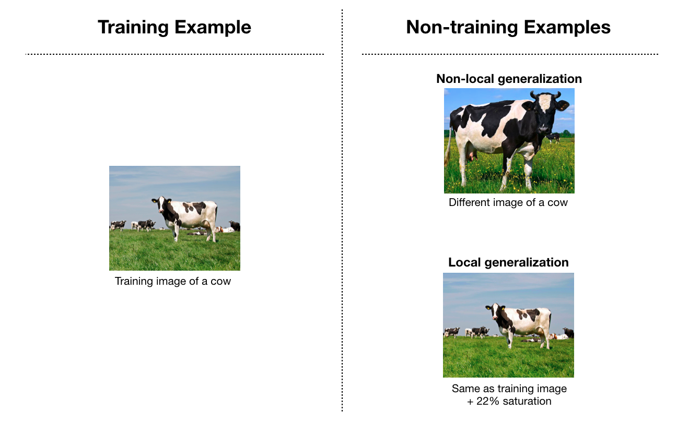
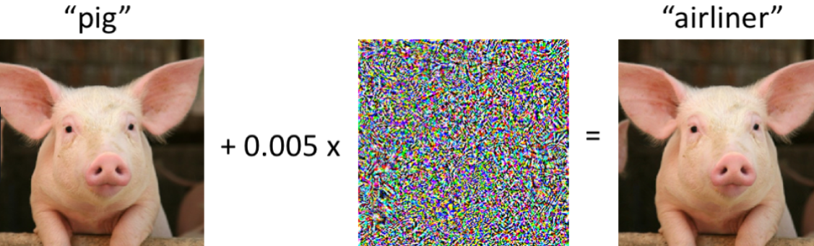

# Intriguing properties of neural networks

Source: https://arxiv.org/pdf/1312.6199.pdf

by Christian Szegedy (Google), Wojciech Zaremba (NYU), Ilya Sutskever (Google), Joan Bruna (NYU), Dumitru Erhan (Google), Ian Goodfellow (UMontreal), Rob Fergus (NYU, Facebook)

Year: 2014

## Activations with random basis

Often we interpret the activation of hidden units as meaningful features,

The method to inspect the maximum activation as it effects the image is below:

x' = argmaxx∈*I*( ø(x) , ei ), where:

-   x is input image from validation dataset _I_
-   ø is activation of some layer
-   ei is the basis vector
    

Results for some specific units on ImageNet (with AlexNet)

When a random new basis is generated v ∈ Rn
The authors find simlarly interpretable semantic properties

x' = argmaxx∈*I*( ø(x) , v )

Results for same specific units with random basis on ImageNet (with AlexNet)

**Results**
It is informally shown that:

-   the natural basis is not better than a random basis for inspecting ø(x)

-   there is no distinction between individual high level units and random linear combinations of high level units, space rather than units that contain semantic information

Therefore:

-   it's how the activations are related to each other (their space) that provides semantic information, rather then the individual units themselves

-   [QUESTION] Can the same neural net be trained and learn completely different activations, yet perform the same? Probably yes.

## Generalization

**Non-local generalization**

-   The assumption that neural nets can generalize to images that look significantly different from the training examples (for example same objects from different view points, same objects from different distances)
-   Specifically this means that the neural net output unit can assign a significant probability to regions of the input space that contain no training examples in their vicinity

**Local generalization**

-   The assumption that neural nets can generalize to images that look similar to the training examples
-   Specifically this means that given a small enough radius ε > 0 and an input image x of class c, all nearby images x+r such that ||r|| < ε should be classified as class c
-   Also known as smoothness prior - small perturbation to image should not change underlying class

Non-local generalization is only true if local generalization is true.

## Adversarial Images

Authors show that smoothness assumption does not hold in neural networks by generating adversarial examples.

Adversarial images are training images with a tiny unseen perturbation that makes the network misclassify the image.

Formally stated,

Minimize ||r||2 such that:

-   f( x + r ) = classwrong
-   x + r ∈[0,1]m such that image is still valid

Can be done by approximation: minimizing r + loss(x+r, classwrong)

**Example:**

## Experimental Findings

1. Authors were able to generate good adversarial examples for all networks
2. Found _Cross model generalization_ - large fraction of examples were misclassified by completely different networks trained from scratch
3. Found _Cross training-set generalization_ - large fraction of examples are misclassified by networks trained from scratch on a different training set

Above shows that adversarial exampels are somewhat universal.

Continuosly regenerating and retraining on adversarial examples can improve generalization.

## Measuring unstability

Adversarial examples show that a small change to the input can cause a large resulting change on the output.
The authors go through a method to check network stability by measuring the spectrum of each rectified layer.

Procedure involves:

1. Computing the upper Lipschitz constant of each layer
   Lipschitz constant is M such that
   | ø(x2) - ø(x1) | ≤ M| x2 - x1 |
   simplified with x1 = x, x2 = x + r
   | øk(x) - øk(x+r) | ≤ Lk| r |
2. Then L = ∏k Lk
   ...
   More complicated math and eventually the Lipshitz bounds of a network can show instabilities.

Large bounds do not mean adversarial examples will be possible necessarily. However, small Lipshitz bounds guarantee that no adverarial examples appear. The auhors therefore suggest penalizing upper Lipshitz bounds to regularize network.

## Conclusion

This paper found two intriguing properties of neural nets:

1. That the activation space not actual activation is what has semantic meaning.
2. The existence of universal adversarial examples which contradict neural networks' generalization abilities. How can a network generalize and be confused by nearly identical images?
