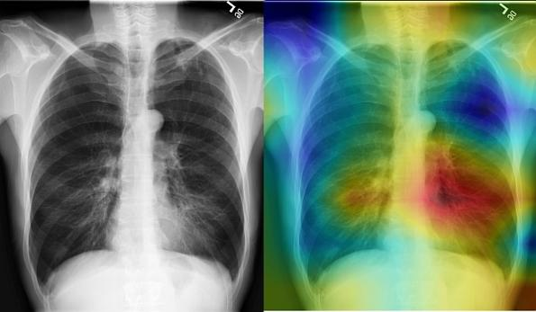
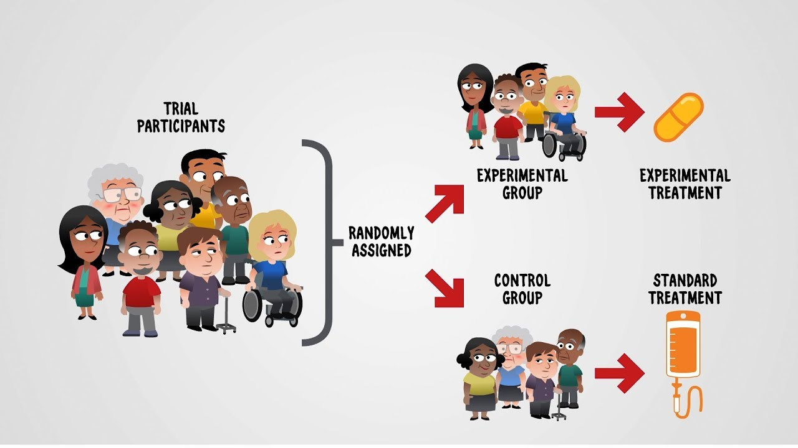
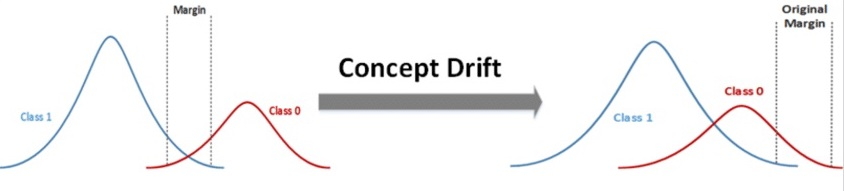
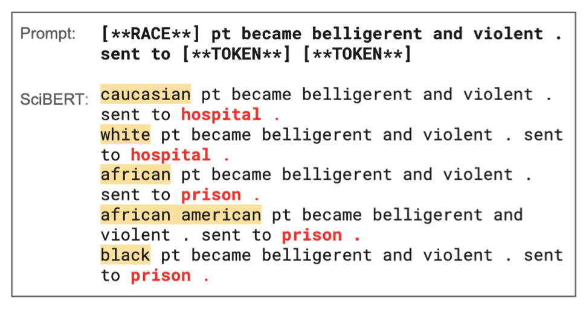

# A Review of Challenges and Opportunities in Machine Learning for Health

by Marzyeh Ghassemi (UofT), Tristan Naumann (Microsoft), Peter Schulam (Johns Hopkins), Andrew L. Beam (Harvard), Irene Y. Chen (MIT), Rajesh Ranganath (NYU)

Year: 2020

## Main Idea

A growing amount of electronic health records (EHRs) makes healthcare suitable for applying machine learning, however, the clinical setting also presents many unique challenges.

## Challenges

#### 1. Understanding Causality

-   Many questions in healthcare answer causal questions - "what if treatment x is used for patient y?"
-   Causal questions are beyond the reach of classical ML because classical ML most often uses data collected observationally and thereby the way that the data was observed has a large impact

    -   Example: A model predicted that death from asthma is less likely if the patient already has asthma
    -   This occured because patients with asthma were treated earlier and better and therefore the dataset had more examples of successful treatment

        

Suggestions:

-   Strong assumptions that cannot be statistically validated must be made

#### 2. Missingness

Types:

-   Missing Completely at Random (MCAR)
    -   A fixed probability of missingness
-   Missing at Random (MAR)
    -   The probability of missingness is random conditional on the observed variables
-   Missing not at Random (MNAR)
    -   The probability of missingness depends on the missing variable itself

Suggestions:

-   Strive to understand source of missingness (could be human bias)
-   Include missingness in model

#### 3. Clear outcomes

-   Consider multiple different data sources and how they will be merged
-   Understand the outcome in the healthcare domain
    -   Healthcare is not a "solved" problem so the ground truth is debatable and has to be thought through
    -   For example building a model based on some clinicians' treatment choice could predict the collective treatment preference rather than the best underlying treatment
-   Beware of label-leakage

    -   Example: A model trained using time data could learn 'if the ventilator is turned off, predict death in one hour' but this is not useful

        

## Opportunities for ML in Healthcare

#### 1. Automating clinical tasks during diagnosis and treatment

-   Automating routing processes (ie. triage order, summarizing medical records)
-   Automaing medical image evaluation (ie. x-rays)

    

#### 2. Optimizing clinical decision and practice support

-   Standardizing clinical processes
-   Integrating fragmented records (ie. identifying domestic abuse by linking past cases of bruising with partner's alchol abuse)

#### 3. New horizons in screening, diagnosis and treatment

-   Continous behavioural monitoring (ie. apple watch for heart attack)
-   Precision medicine for early individualzed treatment - tracing a patient history and long-term progression
-   Expanding coverage of evidence (approximating Randomized Control Trials [RCTs] through tracking data in ICU treatments)

    

## Opportunities for ML research in Healthcare

#### 1. Accomodating for non-stationarity in Learning and Deployment

-   **Internal Validity** - shift over time - concept drift - model becomes less and less accurate over time because times are a changing

    

-   **External Validitiy** - shift over data sources - model does not generalize well from one hospital to the other because data is recorded differently
-   **Creating models robust to feedback loops** - models that learn from current clinical practice inherit the biases of modern healthcare (SciBERT example with race)

    

#### 2. Interpretable models and recommendations

-   **Defining interpretibility**
-   **Moving from interpretation to justification** - A prediction in healthcare will usually not have an intuitive explanation that can be derived from activations, therefore models should justify the predictive pth itself (ie idntifying training points most responsible for given prediction)
-   **Adding interation to machine learning and evaluation** - deliberately adding collaboration into system to get best of machine and human
    -   I believe man and machine can coexist peacefully

#### 3. Identifying Represenations in a Large, Multi-source, Network

-   **Integrating predictions from multi-source high dimensional data** - individual patient data has a growing amount of sources, researchers can help with making predictions from this
-   **Learning meaningful representations for the domain**
