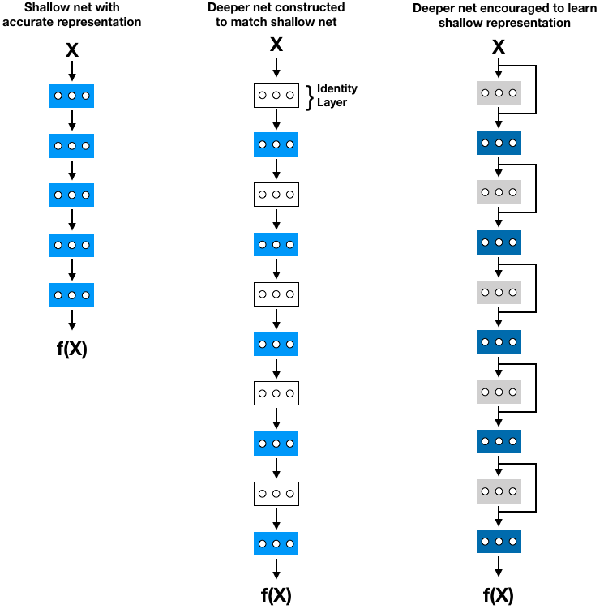
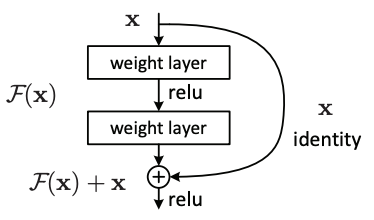
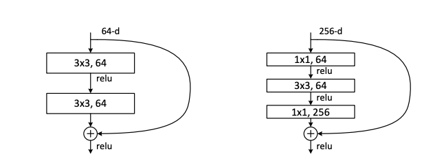
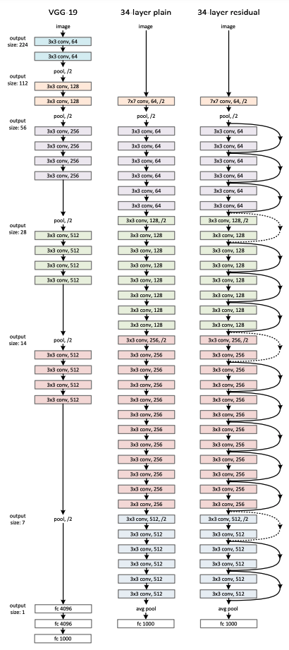

# Deep Residual Learning for Image Recognition

Source: https://arxiv.org/pdf/1512.03385.pdf

by Kaiming He, Xiangyu Zhang, Shaoqing Ren, Jian Sun (Microsoft Research)

Year: 2015

## Main Idea

Training networks with lot's of layers is difficult so this paper proposes the use of residual learning to ease training and increase accuracy.

## Difficulty of Training Deep Networks

When training networks with more layers, accuracy can often become saturated and then degrade. If the training error decreases as accuracy degrades then we are observing overfitting and regularization methods can be applied. Otherwise if the training error increases as accuracy degrades we are observing the degradation problem (most likely due to vanishing or exploding gradient).

Let's consider that we observed the degradation problem when training a network with 5 layers (net5) and a network with 10 layers (net10) on the same task.

We can construct a new 10 layer network by taking the layers of net5 and adding 5 identity layers that don't do anything after each layer. The existence of this constructed network means that net10 is capable of reaching at least the same or better accuracy then net5, but since we observed degradation it is harder to optimize.

The proposed solution is instead of hoping that the larger network learns and improves on the simple construction, we strongly encourage the network to learn the simple construction through residual blocks.

## Residual Blocks

Shortcuts / Skip connections occur when the input of some layer uses information from earlier in the network.

A Residual block (pictured below) is a simple implementation of a skip connection where the input of some layer is an element-wise addition of the previous layer's activation and some past input.

-   Sometimes x must be matrix multiplied by Ws to match F(x) dimensions

Consider we are trying to learn the underlying mapping `x -> H(x)`

-   If `H(x)` is complex then the block will learn `F(x) => H(x) - x`
-   If `H(x)` is the identity function then the block will learn `F(x) => 0`

The authors hypothesized that it is easier to optimize the residual mapping `F(x) + x` then the unreferenced mapping `F(x)` and thus used skip connections every 2 layers for 18 and 34 layers. For deeper nets a special kind of bottle neck block was used to ensure effiient training where the skip connection went over 3 layers.

## Results

The authors were able to train a 152-layer residual net which was the deepest ever presented at ImageNet. An ensemble of different depth nets achieved 3.57% top-5 error and won 1st place at ILSVRC 2015 classification. Further the team got 1st place in ImageNet detection, ImageNet localization, COCO detection, and COCO segmentation.

## Architecture

A comparison between the number of parameters in Resnet and VGG is made in the paper. Resnet-34 has 3.6 billion FLOPS while a VGG-19 has 19.6 billion FLOPs.

> FLOPS are floating point operations per second

The difference is partly because the first layer (blue) of VGG-19 alone has about 3.7B parameters and the next layer (yellow) about 6B parameters. Additionally, by using thinner convolutional layers ResNet managed to keep its parameters a bit lower [more info](https://stats.stackexchange.com/questions/280179/why-is-resnet-faster-than-vgg).

## Training (for classification)

-   Image is resized with shorter side sampled between [256, 480] then random 224x224 crop is taken (horizonal flip can also be used)
-   Per pixel mean is subtracted
-   Batch normalization after each convolution before activation
-   SGD with mini-batch size of 25
-   Learning rate: 0.1, then divided by 10 when error plateau
-   Ierations: 60x104
-   Weight decay: 0.0001
-   Momentum: 0.9
-   No dropout

## Testing (for classification)

-   10 crop tesing
-   Scores averaged over multiple scales
