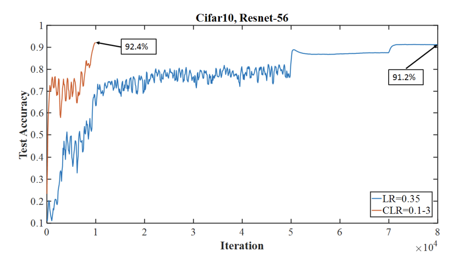

# Super-Convergence: Very Fasy Training of Neural Networks Using Large Learning Rates

Source: https://arxiv.org/abs/1706.04983

by Leslie N. Smith (U.S. Naval Research Lab), Nicholay Topin (University of Maryland)

Year: 2018

## Main Idea

Neural networks are trained a much faser using one learning rate cycle and a large maximum learning rate.

Example of faster training (and higher accuracy):

The higher accuracy depends on step size (amout of iterations in half a cycle).

## Super Convergence Indicator

-   Recall LR range test increases learning rate at each iteration and plots the accuracy to find the min and max learning rate for CLR
-   Super Convergence indicator: LR range test where accuracy remains high with large learning rates

## 1cycle Learning Rate Policy

-   Only use one cycle (slightly smaller than total number of iterations/epochs)
-   In remaining iterations, decrease the learning rate even further than the minimum bound

#### Why it works - Intuition

#### Why it works - Proof

-   The authors compute an optimal learning rate every 10 iterations (using the simplification of the second order Hessian-Free optimization) when training with the 1cycle policy and the standard method
-   They show that the 1cycle policy maintains a high optimal learning rate throughout training, meaning it better finds flat and wide local minima

#### Suggestions

-   Becomes more and more useful with less data
-   Large batch size (ie. 1536 for Cifar 10) is more efective than small batch-size (ie. 256 for Cifar10) when using large learning rates
-   1cycle acts as regularization so other forms of regularization should be reduced
-   Adaptive learning rates: Nesterov momentum, AdaDelta, AdaGrad, Adam do not use sufficiently large learning rates when effective and do not lead to super-convergence

## Results

MNIST with fairly shallow LeNet:

-   training set: 60,000
-   test set: 10,000
-   Using preset hyper-parameters with inv learning rate or step policy learning rate produced accuracy of 99.03% after 85 epochs
-   Using 1cycle policy produces an accuracy near 99.3% in as few as 12 epochs'

ImageNet with ResNet-50 and Inception-Resnet-v2:

-   1cycle must have smaller weight decay (3x10-6 to 10-5) to allow for large learning rate

-   Difference is 20 vs 100 epochs

## New Research Ideas

-   Comprehensive investigations of regularization
    -   When does noise have a positve effect and when does it have a negativve effect
-   Time dependent application of good noise during training
    -   Only CLR and cyclical batch sizes have this time dependence, a more solid combination could be useful
-   Stabilizing optimization (SGD) with large noise
    -   Batch-normalization is a catalyst to enabling super-convergence, are there other ways to stablize SGD with a lot of noise
