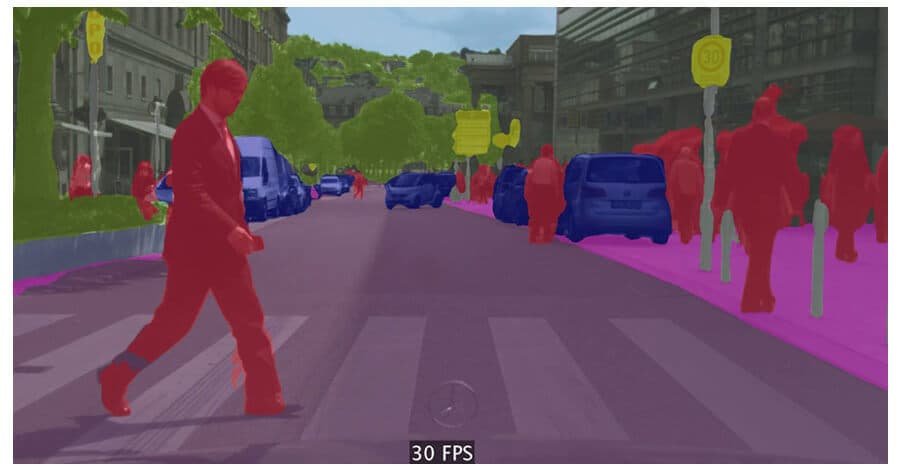
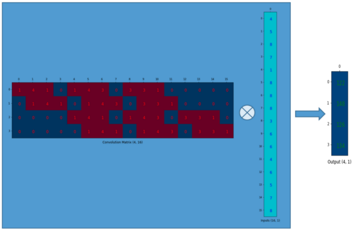
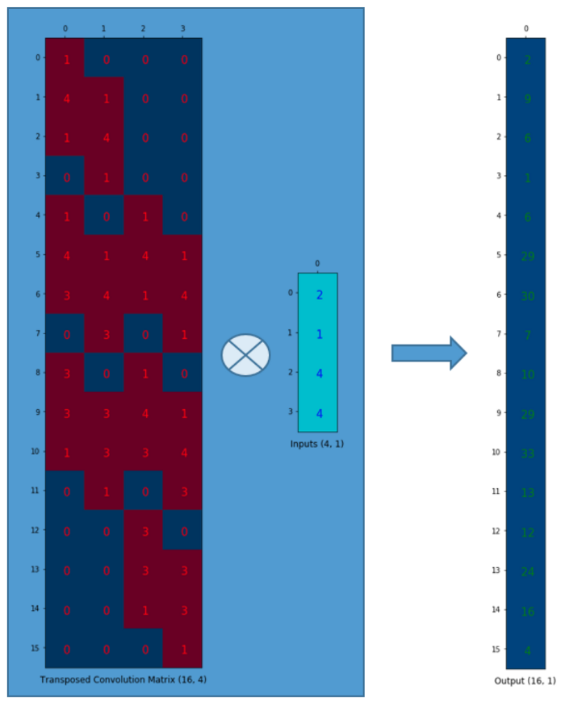
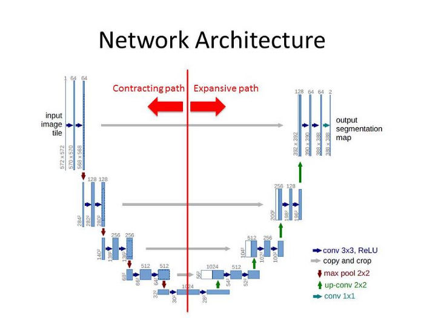

# U-net Convolutional Networks for Biomedical Image Segmentation

Source: https://arxiv.org/pdf/1505.04597.pdf

by Olaf Ronneberger, Philipp Fischer, Thomas Brox

Year: 2015

## Image Segmentation

Unlike image classification where an entire image is labeled by a single class, in image segmentation every pixel of an image is labeled by some class.

Image segmentation is useful for:

-   machine vision (ie. self-drving vechiles)
-   medical imaging
-   document parsing
-   video surveillance

## Previous Image Segmentation Models

-   The previous best image segmentation (Ciresan et al) was done by a sliding window CNN model that predicted each pixel by using the local region (patch) as input.
-   Pros
    -   Does not require a lot of data because you get many patches from each image
-   Cons
    -   Slow because each image is split into patches and network is run completely for each patch
    -   Tradeoff between localization (how accurate a segment is) and use of context (surrounding pixels)
        -   more precision means smaller patches and vice-versa

## Data Augmentation

-   For prediction of border pixels the image is mirrored
-   Elastic deformation was used (especially useful for biomedical images)

## Upsampling Convolutions Primer

-   A regular downsampling convoluion can be rolled out such that the input image is represented as a vector and the convolution as a matrix such that taking the dot product: `conv_matrix@input_vector = output_vector`
    
-   Similarly an upsampling convolution can be accomplished by transposing the conv_matrix: `conv_matrix.T@input_vector = output_vector`

    

## Architecture

-   A U-net contains a contracting path and expansive path that together resemble a U

    -   Interestingly there are no fully connected layers required
        

-   The contracting path identifies WHAT is on the image (but loses WHERE)
    -   By downsampling the image size while adding a large number of feature channels
    -   This is the same pattern as a classic classification CNN architecture (convolution layers followed by relu and max pooling layers)
-   The expansive path identifies WHERE the features found by the contracting path are on the image

    -   Done by upsampling the image through transposed convolutions and concatenation with the feature maps from the contracting path
        -   Concatenation is done along the layers dimension and allows the expansive path to ore easily reconstruct the original image

## Training

-   To maximize GPU memory usage large inputs were favoured over large baches so batch was reduced to single image
-   Hyperparameters:
    -   High momentum 0.99 was used because batches are so small
    -   Softmax activation at end
    -   Cross entropy loss function
        -   With weights, such that background between two touching cells has large impact on loss
-   Weights were initialized by drawing from a Gaussian distribution with a standard deviation of sqrt(2/N) where N is incoming nodes (convolution w*h *feature channels) this is done so each feature map has close to unit variance

## Conclusion

-   U-net won the ISBI EM segmentation challenge
-   A common metric for U-nets are IoU (Intersection over Union) which is calculated by taking intersection of the true and predicted segments and dividing it by the total space covered by the two segments
