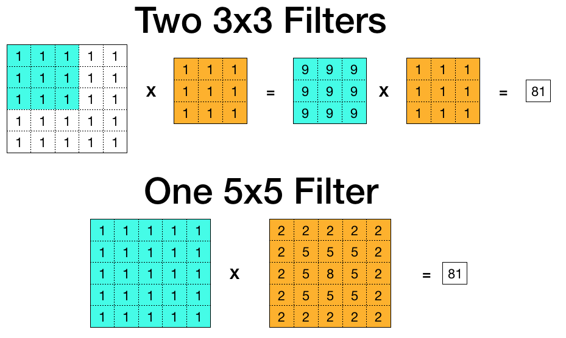
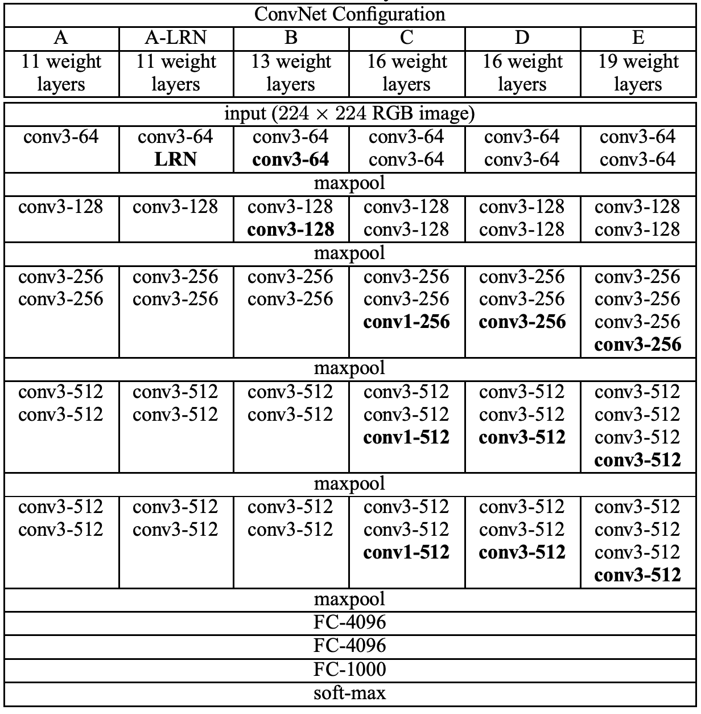

# Very Deep Convolutional Networks for Large-Scale Image Recognition

Source: https://arxiv.org/pdf/1409.1556.pdf

by Karen Simonyan & Andrew Zisserman

Year: 2015

## Main Idea

-   The paper shows that a deep ConvNet (Convolutional Neural Network) with small filters outperforms a shallow Convnet with large filters
-   Two 3x3 filters applied over an image is the same as applying one 5x5 filter

    

-   Using smaller filters allows for:
    -   More non linearity (ReLU layer following each 3x3 convolution) which makes the decision function more discriminitive
    -   Less weight parameters (two 3x3 filters is 18 weights and one 5x5 filter is 25 weights)

## Part 1 - Classification

#### Architecture

AlexNet used 7 layers (Conv and Fully Connected), this paper tests 11, 13, 16, and 19 layers. More layers were possible due to the use of small convolutional filters (3x3) right from the start rather than a large filter (ie 11x11).

The architecture is named VGG-n where n represents the amount of layers and VGG is Visual Geometry Group from Oxford University.

-   Maxpooling here is using a 2x2 window with stride of 2.
-   All hidden layers use a RLU for non-lineaiy
-   Local Response Normalization (used in Alexnet) did not show improvements and thus was only tested in A-LRN

#### Training

-   Fixed 224x224 RGB image (random crop from original), one per SGD iteration
    -   Crops underwent random horizontal flipping and randm RGB colour shift
    -   Authors also experimented with scaling the original image from which the random crop is taken (scaling the images down such that shortest side=224px would mean the input crop represents the whole image, scaling the image up woud mean the crop would correspond to smaller part of image), they tried:
        -   S=256, used by AlexNet
        -   S=384, initilized with pre-trained weights of S=256
        -   S=[256:512], random scale from range (scale jiterring)
-   Preprocessing: substracting mean training set RGB value
-   Optimizing multinomial logisic reression using mini batch grdient descenet
-   Batch size = 256
-   Momentum 0.9
-   Regularization: weight decay and dropout (ratio = 0.5)
-   Learning rate was manually decreased
-   Weight initialization
    -   Net A was trained first shallow enough to work with random initialization (normal distribution zero mean and 10-2 variance)
    -   Laters networks had first four conv layers and last three fully connected layers to that of net A

#### Testing

-   Input image is rescaled to shortest size=Q ( = 0.5( Smin + Smax ))
-   Uncropped image and it's horizontal flip are passed through network
-   Soft-max class posteriors of original and flipped images are averaged
-   Multiple crops at es time not used because increased computation time does not justify potntial gains in accuracy
-   Net E with scale jiterring at trin and test time achieved top-5 val error of 7.5%, 7.3% on test set
-   VGG came in second place for classification at ILSVRC-2014

## Part 2 - Localization

-   VGG came in first place for localization at ILSVRC-2015
-   For localization the output can either be single class regression (SCR) and per-class regression (PCR):
    -   SCR: [class probabilities, bbox-center-x, bbox-center-y, bbox-width, bbox-height]
    -   PCR: [ [class 1 prob, bbox-center-x, ... ], [class 2 prob, bbox-center-x, ...] ... ]
        -   PCR was found to have 2% lower localization error than SCR

#### Training

Similar to training for classification except:

-   Logistic loss -> Euclidean loss (penalizes deviation of predicted bbox from ground truth)
-   Did not have time to use scale jiterring, only did S=256 and S=384

#### Testing

Two testing protocols:

1. To simply compare different modifications the center crop of the image was used, only the predicted bounding box for the ground truth class was evaluated
    - Lowest localization error here was 33.1%
2. More comprehensive test was done by using greedy merging of output bounding boxes and then rating the bounding boxes based on class scores
    - Lowest localization error here was 25.3% (by using multiple models)

The predicted bounding box was deemed correct if he IoU (Intersection over union) ratio with ground truth box was above 0.5

## Part 3 - Genralization

VGG was further tested on other smaller datasets (VOC-2007, VOC-2012, Caltech-101, Caltech-256) by removing the last FC1000 layer and tuning a new layer to match the amount of classes in the given dataset. Through slight modifications to better fit the unique features of dataset VGG achieved state-of-the-art or better. Including in a separate test when used for Object detection.
